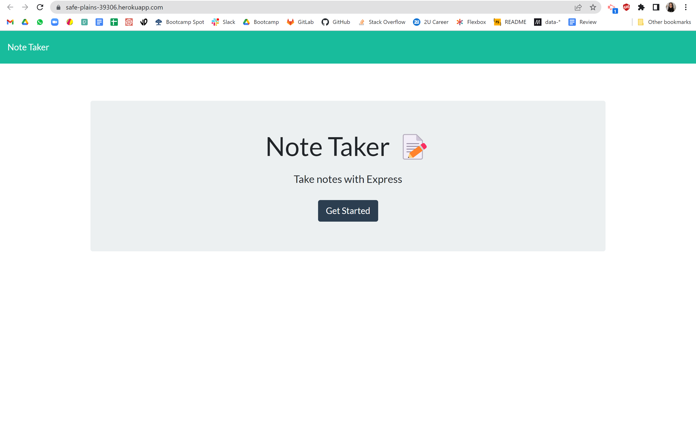

# Note Taker

## Objective
The objective of this challenge was to finalize a project with starter code by using express.js to have notes taken, saved, and appear on page load. An added feature would be to have a note deleted.

## Approach
My approach was to write out the steps needed to complete this, watch some tutorials on express to get more familiar with it, further analyze my steps following the tutorials, and then start coding!

## End Result
The end result is not exactly what I was hoping for. I wanted to have a complete and functioning application but there is a lot that is lacking.

## Reflection
This assignment was very hard. I did not feel comfortable starting it and ran into many issues with my code. It took two tutors and a couple days to resolve a console log error that did not tell me much. After that I used code from activities to help guide me in the right direction but ran into another error that took more time to resolve. Time was not on my side this week and I unfortunately ran out of it to complete this assignment.

## Final Product
[Deployed application on Heroku]()